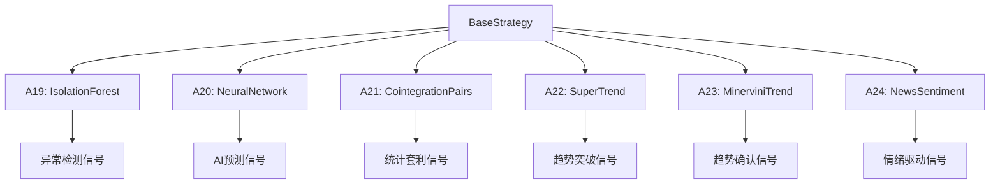
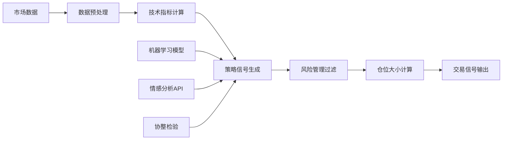

# Finance目录量化策略集成设计文档

## 📋 概述

本文档详细描述了如何将Finance目录中的量化策略算法集成到main/strategies主工程中。基于对Finance目录的深入分析，我们识别出6个最具价值的算法进行集成，形成A19-A24策略系列。

## 🎯 集成策略总览

| 策略编号 | 策略名称 | 基础算法 | 核心价值 | 复杂度 |
|---------|---------|---------|---------|--------|
| A19 | 增强版Isolation Forest异常检测 | sklearn_trading_bot.py | 市场异常检测，风险控制 | 中等 |
| A20 | 神经网络预测策略 | neural_network_prediction.py | AI价格预测，趋势识别 | 高 |
| A21 | 协整配对交易策略 | pairs_trading.py | 统计套利，市场中性 | 高 |
| A22 | 超级趋势策略 | super_trend.py | 趋势跟踪，突破信号 | 低 |
| A23 | 米涅维尼趋势模板 | minervini_screener.py | 趋势确认，多因子筛选 | 中等 |
| A24 | 新闻情感交易策略 | stock_news_sentiment.py | 情绪分析，事件驱动 | 高 |

## 🏗️ 架构设计

### 策略继承架构



### 数据流设计



## 📊 详细策略设计

### A19: 增强版Isolation Forest异常检测策略

#### 策略逻辑
- 使用Isolation Forest算法检测价格异常
- 在异常点生成交易信号（买入均值回归，卖出异常高点）
- 结合成交量确认和趋势过滤

#### 关键参数
- `contamination`: 异常比例 (默认0.001)
- `min_volume_ratio`: 最小成交量比率 (默认2.0)
- `cooldown_period`: 信号冷却期 (默认7天)

#### 信号生成规则
1. 检测到异常点 (-1标签)
2. 价格高于均值 → 卖出信号
3. 价格低于均值且冷却期结束 → 买入信号
4. 成交量放大确认

#### 风险管理
- 较小仓位 (max_position_size=0.05)
- 严格止损 (stop_loss_pct=0.03)
- 较短持有期 (max_holding_days=3)

### A20: 神经网络预测策略

#### 策略逻辑
- 使用MLPRegressor预测短期价格走势
- 基于预测偏差生成交易信号
- 多时间框架确认

#### 关键参数
- `prediction_window`: 预测窗口 (默认5天)
- `confidence_threshold`: 置信度阈值 (默认0.7)
- `model_update_freq`: 模型更新频率 (默认30天)

#### 信号生成规则
1. 训练神经网络模型预测未来价格
2. 计算预测误差和置信区间
3. 实际价格偏离预测 → 生成反向信号
4. 多指标确认 (RSI, MACD, 成交量)

#### 风险管理
- 动态仓位调整基于预测置信度
- 较宽止损容忍度 (stop_loss_pct=0.05)
- 较长持有期 (max_holding_days=10)

### A21: 协整配对交易策略

#### 策略逻辑
- 寻找协整股票对
- 计算价差并标准化
- 在价差偏离均值时建立对冲头寸

#### 关键参数
- `coint_significance`: 协整显著性水平 (默认0.05)
- `zscore_entry_threshold`: 入场Z-Score阈值 (默认2.0)
- `max_pairs_per_symbol`: 最大配对数 (默认3)

#### 信号生成规则
1. 计算协整检验统计量
2. 构建价差序列并标准化
3. Z-Score超过阈值时建立头寸
4. 定期再平衡对冲比例

#### 风险管理
- 市场中性设计 (beta对冲)
- 严格止损 (stop_loss_pct=0.02)
- 较长持有期 (max_holding_days=20)

### A22: 超级趋势策略

#### 策略逻辑
- 计算超级趋势指标
- 在趋势方向变化时生成信号
- 结合ATR动态止损

#### 关键参数
- `atr_period`: ATR周期 (默认14)
- `factor`: 乘数因子 (默认3.0)
- `trend_confirmation`: 趋势确认周期 (默认2)

#### 信号生成规则
1. 计算上轨和下轨
2. 价格突破上轨 → 卖出信号
3. 价格突破下轨 → 买入信号
4. 多周期确认避免假突破

#### 风险管理
- ATR动态止损
- 趋势跟踪 (trailing_stop_pct=0.02)
- 中等持有期 (max_holding_days=7)

### A23: 米涅维尼趋势模板策略

#### 策略逻辑
- 实现Mark Minervini的趋势模板
- 多因子筛选优质趋势股
- 结合技术分析和基本面指标

#### 关键参数
- `trend_strength_min`: 最小趋势强度 (默认50%)
- `volume_confirmation`: 成交量确认 (默认True)
- `fundamental_filters`: 基本面过滤 (默认启用)

#### 信号生成规则
1. 筛选强趋势股票
2. 验证基本面质量
3. 等待合适的入场时机
4. 严格的退出纪律

#### 风险管理
- 趋势验证 (trend_strength_min=50%)
- 基本面过滤
- 较宽止损 (stop_loss_pct=0.08)
- 较长持有期 (max_holding_days=30)

### A24: 新闻情感交易策略

#### 策略逻辑
- 分析新闻和社交媒体情感
- 结合价格行为确认信号
- 多源情感数据融合

#### 关键参数
- `sentiment_threshold`: 情感阈值 (默认0.3)
- `news_sources`: 新闻来源权重
- `reaction_window`: 反应窗口 (默认30分钟)

#### 信号生成规则
1. 收集多源情感数据
2. 计算综合情感得分
3. 情感极值时生成信号
4. 价格确认和成交量放大

#### 风险管理
- 情感波动过滤
- 较小仓位 (max_position_size=0.03)
- 较短持有期 (max_holding_days=2)

## ⚙️ 配置参数设计

### 全局配置 (config.py)
```python
'strategy_a19': {
    'contamination': 0.001,
    'min_volume_ratio': 2.0,
    'cooldown_period': 7,
    # ... 其他参数
},
'strategy_a20': {
    'prediction_window': 5,
    'confidence_threshold': 0.7,
    'model_update_freq': 30,
    # ... 其他参数
},
# ... 其他策略配置
```

### 策略特定配置
- 每个策略维护独立的配置字典
- 支持运行时参数调整
- 包含默认值和验证逻辑

## 🔧 实现指南

### 代码结构
```
strategies/
├── a19_isolation_forest.py    # A19策略实现
├── a20_neural_network.py      # A20策略实现
├── a21_cointegration_pairs.py # A21策略实现
├── a22_super_trend.py         # A22策略实现
├── a23_minervini_trend.py     # A23策略实现
├── a24_news_sentiment.py      # A24策略实现
└── indicators.py              # 扩展指标库
```

### 依赖管理
- 新增机器学习依赖: scikit-learn, tensorflow
- 情感分析依赖: nltk, textblob
- 协整检验依赖: statsmodels

### 测试策略
1. 单元测试: 信号生成逻辑
2. 集成测试: 与现有系统兼容性
3. 回测测试: 历史表现验证
4. 压力测试: 极端市场条件

## 📈 性能评估指标

### 策略评估维度
- **夏普比率**: 风险调整收益
- **最大回撤**: 最大亏损幅度
- **胜率**: 盈利交易比例
- **盈亏比**: 平均盈利/平均亏损
- **年化收益**: 年度化收益率

### 风险指标
- **VaR (95%)**: 95%置信度下的最大亏损
- **Beta**: 市场相关性
- **波动率**: 收益标准差

## 🚀 实施路线图

1. **Phase 1**: 实现A22超级趋势策略 (复杂度低，快速验证)
2. **Phase 2**: 实现A19隔离森林策略 (中等复杂度)
3. **Phase 3**: 实现A23米涅维尼策略 (中等复杂度)
4. **Phase 4**: 实现A20神经网络策略 (高复杂度)
5. **Phase 5**: 实现A21协整配对策略 (高复杂度)
6. **Phase 6**: 实现A24新闻情感策略 (高复杂度，需要外部API)

## 📋 验收标准

- [ ] 所有新策略成功集成到主工程
- [ ] 策略配置正确加载
- [ ] 信号生成逻辑正确实现
- [ ] 风险管理机制有效
- [ ] 回测表现符合预期
- [ ] 文档完整更新
- [ ] 测试覆盖率>80%

---

*本文档将作为后续策略实现的详细指南和验收标准。*